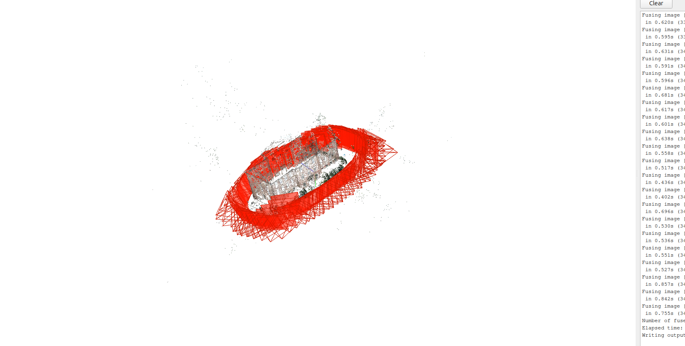
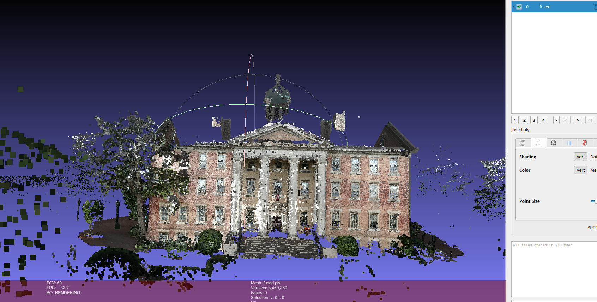

# Southhall 3D Recreation using COLMAP

This project dataset was available and me testing it out to learn how colmap works

What i learnt in this : 
1. Installation of COLMAP using VCPKG
2. Structure-from-Motion (SFM) and Multi-View Stereo
3. Feature Ectraction and Matching
4. Importing .ply to meshlab

This is a very basic thing, which is done but leveling up every day.

Outputs: 1st in colmap and 2nd is meshlab

  
  

